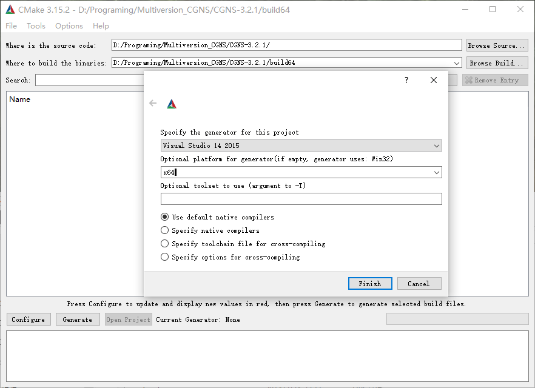
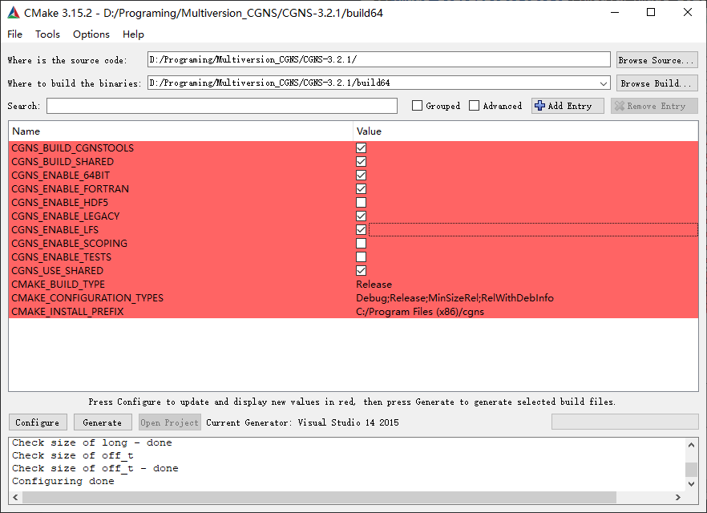
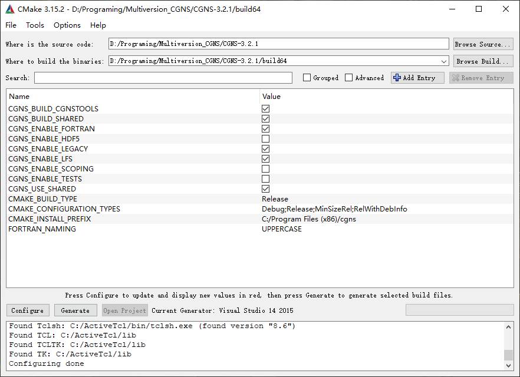

This repository record the process of compiling, installing and using the CGNS library on the Windows platform (Fortran). [[中文](./README_CN.md)]

## Compiling

### Environment

Installed software

1. Visual Studio 2015
2. Intel Visual Fortran 2018
3. [Cmake](https://cmake.org/download/)
4. [Active Tcl](https://www.activestate.com/products/tcl/downloads/)  (Optional)
   If you need to compile CGNS Tools.
5. [HDF5](https://www.hdfgroup.org/downloads/)（Optional according to requirements）
   ADF or HDF.
6. [NSIS](https://nsis.sourceforge.io/Main_Page) or [WiX](https://wixtoolset.org/)
   NSIS will create a .exe installer. WiX will create a .msi installer.
7. [Perl](https://www.perl.org/get.html#win32)（Not necessary）

The file need to download

1. [CGNS SourceCode](https://cgns.github.io/download.html)
   Suggest a new project written by Fortran use version even or greater than 3.3.0. Old projects use 3.2.1 or lower as a springboard:

> Important note for Fortran users: V3.3 removes the usage of "include cgnslib_f.h". Instead, from this release forward, one must now employ the module "use CGNS". Also, if making use of 64-bit integers, Fortran programs must declare the relevant 64-bit integers via, e.g.: integer(cgsize_t) integername.

Other considerations：

1. Extract the CNGS source code to a directory  which absolute path  has no space character and Chinese characters.

### Cmake configure CGNS

Open Cmake-gui, specify CNGS source code directory, compile directory, and click Configure to specify compiler related projects:

Waiting when configure is done, check configuration and enable 64-bit, Fortran support, and old version support (LEGACY). The configuration is shown in the figure.
If you checked cgnstools, you need to give .h and .lib file's location of the tk/tcl.

After Everything is done.

Click Generate to generate the Visual Studio project, then click Open Project to open cgns.sln, select release and then generate.

The [Release](https://github.com/nescirem/win_CGNS/releases) page of this repository provides CGNS3.2.1-lib compiled by Visual Studio 2015.