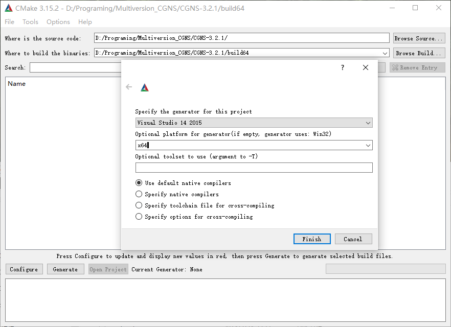
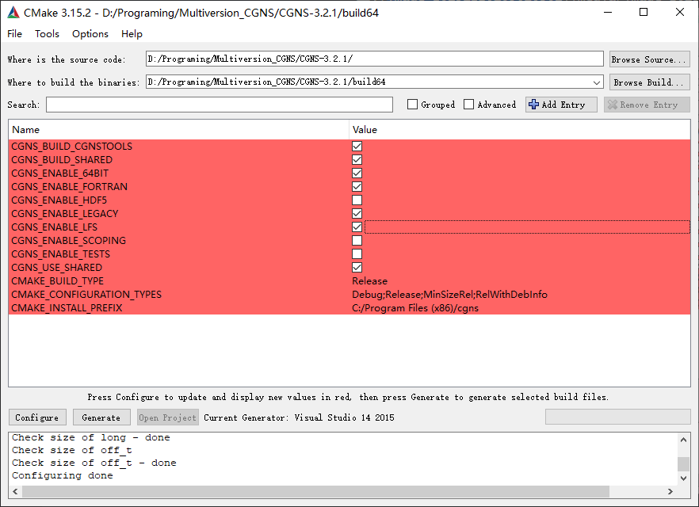
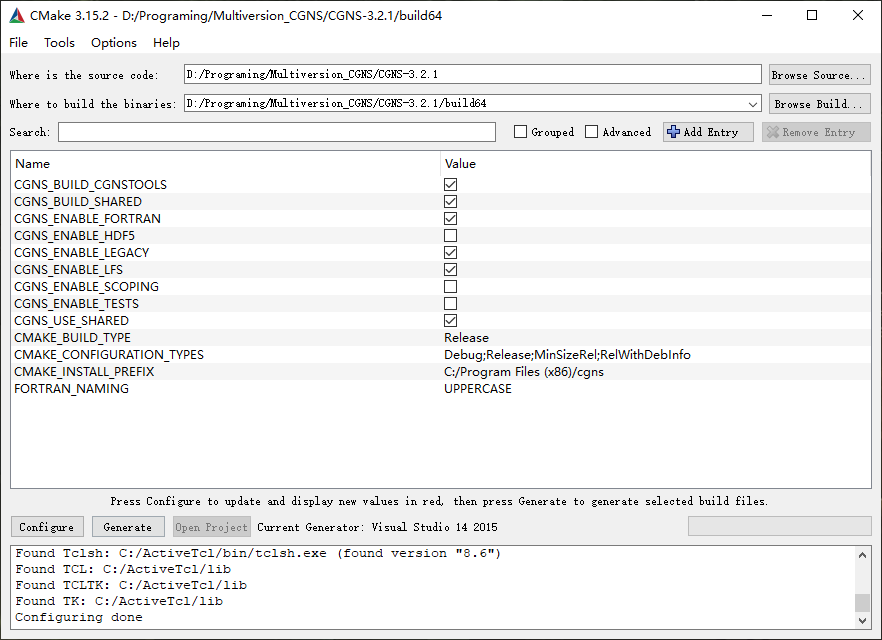

用于记录Windows平台上CGNS链接库的编译、安装与使用（仅Fortran）。 [[English](./README.md)]

## 编译

### 环境

已经安装的软件：

1. Visual Studio 2015
2. Intel Visual Fortran 2018
3. [Cmake](https://cmake.org/download/)
4. [Active Tcl](https://www.activestate.com/products/tcl/downloads/) （可选）
   如果需要编译CGNS Tools则可能会用到
5. [HDF5](https://www.hdfgroup.org/downloads/)（根据需求可选）
   ADF 或 HDF
6. [NSIS](https://nsis.sourceforge.io/Main_Page) 或 [WiX](https://wixtoolset.org/)（任选其一）
   NSIS 会将CGNS链接库打包成 .exe 安装包，WiX 则会打包成 .msi 安装包。
7. [Perl](https://www.perl.org/get.html#win32)（非必须）

需要下载的文件：

1. [CGNS源代码](https://cgns.github.io/download.html)
   使用Fortran重新开发的CAE软件推荐使用v3.3.0及以上版本，而较老代码推荐使用v3.2.1承上启下，原因：
> Important note for Fortran users: V3.3 removes the usage of "include cgnslib_f.h". Instead, from this release forward, one must now employ the module "use CGNS". Also, if making use of 64-bit integers, Fortran programs must declare the relevant 64-bit integers via, e.g.: integer(cgsize_t) integername.

其他要求：

1. 将CNGS源代码解压到任意绝对路径不包含空格不包含中文的目录。

### Cmake-gui配置CGNS

打开Cmake-gui，指定CNGS源代码目录、编译目录，点击Configure指定编译器相关项目：

等待完成后，通过勾选复选框开启64位、Fortran以及对老版本LEGACY的支持等，配置如图所示
如果你勾选了cgnstools的话，则需要给定tk/tcl头文件以及链接库的位置（如果没这个需求还是别选了罢）

配置完成后

点击Generate生成Visual Studio项目，然后点击Open Project打开cgns.sln，选择release然后生成即可。

在本Repository的[Release](https://github.com/nescirem/win_CGNS/releases)页提供了Visual Studio 2015编译的CGNS3.2.1-lib。

